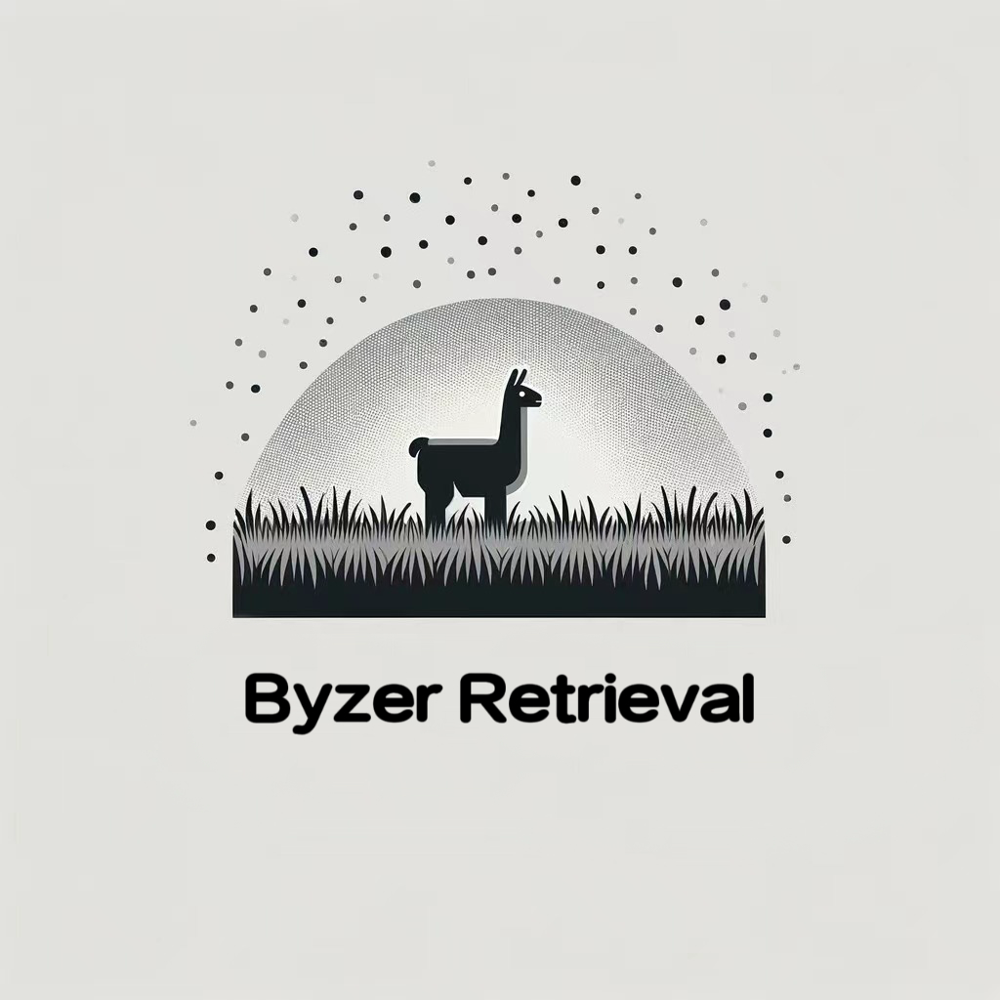
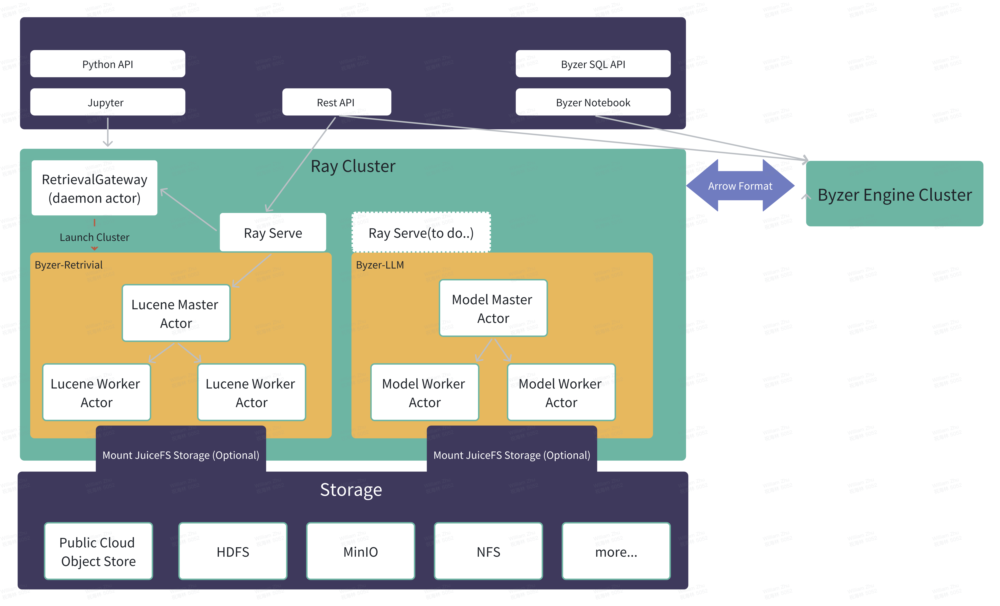

<p align="center">
  <picture>    
    
  </picture>
</p>

<h3 align="center">
Easy, fast, and cheap Storage for LLM 
</h3>

<p align="center">
| <a href="#"><b>Documentation</b></a> | <a href="#"><b>Blog</b></a> | | <a href="#"><b>Discord</b></a> |

</p>

---

*Latest News* 🔥

- [2023/11] Release Byzer-Retrieval 0.1.4

---

## Introduction

Byzer-retrieval is a distributed retrieval system which designed as a backend for LLM RAG (Retrieval Augmented Generation).
The system supports both full-text search and vector retrieval algorithm, you can also use both of them at the same time and 
get a fusion score for each document. 

This project is implemented based on Lucene + Ray which use Lucene to build the inverted index/vector index and
use Ray to build the distributed system. 

In contrast to the traditional way,there is no need to deploy so many systems e.g. the Elasticsearch or Milvus, 
and reduce the cost of deployment and maintenance.  You can reuse the cluster which is used for training/serving the LLM model 
because Byzer-retrieval use CPU/Memory(LLM using GPU/GPU Memory) which will make full use of the resources. 

Notice that this project requires JDK 21 or higher, because the new features of JDK 21 e.g. vector API
and foreign memory will bring a great performance improvement to the system. We also introduce the virtual threads in Java
to improve the concurrency performance of cluster.

---  

## Versions

### 0.1.4
Download: https://download.byzer.org/byzer-retrieval/byzer-retrieval-lib-0.1.4.tar.gz

1. Support filter query 
2. Fix minor bugs

### 0.1.3
Download: https://download.byzer.org/byzer-retrieval/byzer-retrieval-lib-0.1.3.tar.gz

1. fix the issue that the jvm options is not set correctly when launching the cluster
2. sort the collection when fetch results from the multiple shards otherwise the results will be disordered and cause the rerank error.

### 0.1.2
Download: https://download.byzer.org/byzer-retrieval/byzer-retrieval-lib-0.1.2.tar.gz

1. fix rerank bug
2. add shutdown cluster API

### Old Versions
- 0.1.1: support multi-requests at the same time
- 0.1.0: first version

## Quick Installation

1. Install Ray

   ```shel
   conda create -n byzer-retrieval python=3.10.11
   conda activate byzer-retrieval
   pip install -r requirements.txt
   
   ray start --head  --dashboard-host 0.0.0.0
   ```

2. Download the latest version of [Byzer-Retrieval Package](https://download.byzer.org/byzer-retrieval/) 
    and the JDK-21, extract them to the local disk in every node in Ray. 

3. Install Byzer-Retrieval

   ```python
   import ray
   from byzerllm.utils.retrieval import ByzerRetrieval
      
   code_search_path=["/home/winubuntu/softwares/byzer-retrieval-lib/"]
   env_vars = {"JAVA_HOME": "/home/winubuntu/softwares/jdk-21",
               "PATH":"/home/winubuntu/softwares/jdk-21/bin:/home/winubuntu/.cargo/bin:/usr/local/cuda/bin:/home/winubuntu/softwares/byzer-lang-all-in-one-linux-amd64-3.1.1-2.3.2/jdk8/bin:/home/winubuntu/miniconda3/envs/byzerllm-dev/bin:/home/winubuntu/miniconda3/condabin:/usr/local/sbin:/usr/local/bin:/usr/sbin:/usr/bin:/sbin:/bin:/usr/games:/usr/local/games:/snap/bin"}
   
   
   ray.init(address="auto",namespace="default",
                    job_config=ray.job_config.JobConfig(code_search_path=code_search_path,
                                                         runtime_env={"env_vars": env_vars})
                    )
   
   retrieval = ByzerRetrieval() 
   # you can use ray.kill(ray.get_actor("RetrievalGateway")) 
   # to kill the RetrievalGateway actor if you want to restart the RetrievalGateway actor. 
   retrieval.launch_gateway()
   
   builder = retrieval.cluster_builder()
   builder.set_name("cluster1").set_location("/tmp/cluster1").set_num_nodes(2).set_node_cpu(1).set_node_memory("3g")
   builder.set_java_home(env_vars["JAVA_HOME"]).set_path(env_vars["PATH"]).set_enable_zgc()
   builder.start_cluster()
   ```

Now you can check the retrieval cluster in Ray Dashboard or you can use the following code to check the cluster:

```python
retrieval.clusterInfo("cluster1")
```

If there is something wrong,you can validate the Environment e.g. `JAVA_HOME` and `PATH` before you
can launch the retrieval gateway in every kind of API(Python/Byzer-SQL/Rest).

Try to use the following code to validate the environment especially the `PATH` is correct:

```python
import os
os.environ["JAVA_HOME"]="/home/winubuntu/softwares/jdk-21"
os.environ["PATH"]="/home/winubuntu/softwares/jdk-21/bin:/home/winubuntu/.cargo/bin:/usr/local/cuda/bin:/home/winubuntu/softwares/byzer-lang-all-in-one-linux-amd64-3.1.1-2.3.2/jdk8/bin:/home/winubuntu/miniconda3/envs/byzerllm-dev/bin:/home/winubuntu/miniconda3/condabin:/usr/local/sbin:/usr/local/bin:/usr/sbin:/usr/bin:/sbin:/bin:/usr/games:/usr/local/games:/snap/bin"
os.execvp("bash", args=["bash", "-c", "java -version"])
```

If this script fails, The `PATH` is not correct, and you need to check the `PATH` again.
You may miss some key paths e.g. `/usr/local/bin:/usr/bin:/usr/local/sbin:/usr/sbin` in the `PATH`.


## Architecture



The above figure shows the architecture of Byzer-retrieval. The user can use Python/Rest/SQL API to launch a RetrievalGateway,
and then use the RetrievalGateway to create a retrieval cluster. Actually, you can create any number of clusters, and each cluster can contain any number of tables.
Notice that all tables in the same cluster have the same shard number. Each cluster will have a master actor and 
some worker actors, and all these actors are Java actors. The master actor is as the entry point of the cluster.

If you use python API to insert data into the table, the data will be put in the ray cluster object store, and then the 
master actor will route the data to the worker actors. The worker actors will build the index in parallel.

### Build the jar file and dependency from source code

Here is the command to build the jar file and dependency from source code:

```
## use jdk 21 to compile the project
export JAVA_HOME=/home/winubuntu/softwares/jdk-21
export PATH=$JAVA_HOME/bin/:$PATH
mvn clean package -DskipTests
mvn dependency:copy-dependencies -DoutputDirectory=target/dependency
```

Then copy the jar file and dependency to the ray cluster. Suppose you put
all the jars in `/home/winubuntu/softwares/byzer-retrieval-lib/`.

> If you want to use Byzer-SQL API, you need to download the `byzer-llm` jar file and put it in `$BYZER_HOME/plugin/` directory.


## Usage (high-level Python API)      

Once you have a retrieval cluster, now try to create a database/table in the cluster:

```python
retrieval.create_table("cluster1",TableSettings(
    database="db1",table="table1",
    schema='''st(
field(_id,long),
field(name,string),
field(content,string,analyze),
field(vector,array(float)))''',
    location="",num_shards=1,
))
```

After that, we can insert some data into the table:

```python
data = [
    {"_id":1, "name":"a", "content":"b c", "vector":[1.0,2.0,3.0]},
    {"_id":2, "name":"d", "content":"b e", "vector":[1.0,2.6,4.0]}
]

retrieval.build_from_dics("cluster1","db1","table1",data)

retrieval.commit("cluster1","db1","table1")
```
In this step, we will insert the data into the table, and build the index. Notice that 

1. we need to commit the index after building the index to make the index persistent.
2. we strongly recommend use JuiceFS to store the index data, because JuiceFS is a distributed file system which is 
   compatible with POSIX, and it is very easy to deploy and use. 


For now, we can search the data.

try to search by keyword:
```python
retrieval.search_keyword("cluster1","db1","table1",
                     keyword="c",fields=["content"],limit=10)
## output: [{'name': 'a', '_id': 1, '_score': 0.31506687, 'content': 'b c'}]
```

try to search by vector:
```python
retrieval.search_vector("cluster1","db1","table1",
                    vector=[1.0,2.0,3.0],vector_field="vector",limit=10)
## output: [{'name': 'a', '_id': 1, '_score': 1.0, 'content': 'b c'},{'name': 'd', '_id': 2, '_score': 0.9989467, 'content': 'b e'}]                    
```

or you can search by both keyword and vector:

```python
from byzerllm.records import SearchQuery
retrieval.search("cluster1","db1","table1",
                    [SearchQuery(keyword="c",fields=["content"],
                                vector=[1.0,2.0,3.0],vectorField="vector",
                                limit=10)])

## output: [{'name': 'a', '_id': 1, '_score': 0.016666668, 'content': 'b c'},
## {'name': 'd', '_id': 2, '_score': 0.016393442, 'content': 'b e'}]
```


You can also do follow operations to the table:

1. truncate: delete all data in the table
2. close: close the table and release the resources
3. closeAndDeleteFile: close the table and delete the index files

```python
retrieval.truncate("cluster1","db1","table1")
retrieval.close("cluster1","db1","table1")
retrieval.closeAndDeleteFile("cluster1","db1","table1")
```

## Shutdown the Cluster

You can use the following code to shutdown the cluster:

```python
retrieval.shutdown_cluster(cluster_name="cluster1")
```


## Cluster Recovery

When the Retrieval Cluster  is crash or the Ray Cluster is down, we need to recover our cluster. You can manually
export cluster metadata, and then save it to the storage. Try to use the following code to export the metadata:

```python
cluster = retrieval.cluster("cluster1")
cluster1_meta = json.loads(ray.get(cluster.clusterInfo.remote()))
# save s to file
with open("/tmp/cluster_info.json","w") as f:
    json.dump(cluster1_meta,f,ensure_ascii=False)
```

Then you can use the following code to recover the cluster once the cluster is down:

```python
import json
import os
import ray
from byzerllm.records import EnvSettings,ClusterSettings,TableSettings,JVMSettings
from byzerllm.utils.retrieval import ByzerRetrieval

with open("/tmp/cluster_info.json","r") as f:
    s = json.load(f)

retrieval = ByzerRetrieval()
retrieval.launch_gateway()
retrieval.restore_from_cluster_info(s)
```

Notice that if the Ray Cluster is down, you need to connect it Ray cluster first, and then restore the retrieval cluster.

```python
import json
import os
import ray
from byzerllm.records import EnvSettings,ClusterSettings,TableSettings,JVMSettings
from byzerllm.utils.retrieval import ByzerRetrieval

with open("/tmp/cluster_info.json","r") as f:
    s = json.load(f)

code_search_path=["/home/winubuntu/softwares/byzer-retrieval-lib/"]
env_vars = {"JAVA_HOME": s["envSettings"]["javaHome"],
            "PATH":s["envSettings"]["path"]}

ray.init(address="auto",namespace="default",
                 job_config=ray.job_config.JobConfig(code_search_path=code_search_path,
                                                      runtime_env={"env_vars": env_vars})
                 )

retrieval = ByzerRetrieval()
retrieval.launch_gateway()
retrieval.restore_from_cluster_info(s)

```

## Rest API

We also provide a rest api to access the retrieval clusters. You can use the following code to start the rest api:

```python

import ray
from byzerllm.utils.retrieval.rest import deploy_retrieval_rest_server

code_search_path=["/home/winubuntu/softwares/byzer-retrieval-lib/"]
env_vars = {"JAVA_HOME": "/home/winubuntu/softwares/jdk-21",
            "PATH":"/home/winubuntu/softwares/jdk-21/bin:/home/winubuntu/.cargo/bin:/usr/local/cuda/bin:/home/winubuntu/softwares/byzer-lang-all-in-one-linux-amd64-3.1.1-2.3.2/jdk8/bin:/home/winubuntu/miniconda3/envs/byzerllm-dev/bin:/home/winubuntu/miniconda3/condabin:/usr/local/sbin:/usr/local/bin:/usr/sbin:/usr/bin:/sbin:/bin:/usr/games:/usr/local/games:/snap/bin"}

ray.init(address="auto",namespace="default",
                 job_config=ray.job_config.JobConfig(code_search_path=code_search_path,
                                                      runtime_env={"env_vars": env_vars}),ignore_reinit_error=True
                 )

deploy_retrieval_rest_server(host="0.0.0.0",route_prefix="/retrieval")
```

Then you can use endpoint `http://127.0.0.1:8000/retrievel` to access the retrieval cluster.
                              
create a retrieval cluster:

```python
import requests
import json
from byzerllm.utils.retrieval.rest import (ClusterSettingsParam,
                                           EnvSettingsParam,
                                           JVMSettingsParam,
                                           ResourceRequirementParam,
                                           ResourceRequirementSettingsParam)

r = requests.post("http://127.0.0.1:8000/retrieval/cluster/create",json={
    "cluster_settings":ClusterSettingsParam(
            name="cluster1",
            location="/tmp/cluster1",
            numNodes=1
        ).dict(), 
    "env_settings":EnvSettingsParam(
            javaHome=env_vars["JAVA_HOME"],
            path=env_vars["PATH"]
        ).dict(), 
    "jvm_settings":JVMSettingsParam(
            options=[]
        ).dict(), 
    "resource_requirement_settings": ResourceRequirementSettingsParam(
        resourceRequirements=[ResourceRequirementParam(name="CPU",resourceQuantity=1.0)]).dict()
})
r.text
```

or recover the cluster is also supported in the rest api, you can use the following code to recover the cluster:

```python
import requests
import json

with open("/tmp/cluster_info.json","r") as f:
    s = f.read()

r = requests.post("http://127.0.0.1:8000/retrieval/cluster/restore",params={
    "cluster_info":s
})
json.loads(r.text)
```

get cluster info:

```python
import requests
import json

r = requests.get("http://127.0.0.1:8000/retrieval/cluster/get/cluster1")
json.loads(r.text)
```

create a table:

```python
import requests
import json
from byzerllm.utils.retrieval.rest import TableSettingsParam

r = requests.post("http://127.0.0.1:8000/retrieval/table/create/cluster1",json=TableSettingsParam(
    database="db1",table="table1",
    schema="st(field(_id,long),field(name,string),field(content,string,analyze),field(vector,array(float)))",
    location="/tmp/cluster1",num_shards=1,
).dict())

r.text
```

insert data:

```python
import requests
import json
from byzerllm.utils.retrieval.rest import TableSettingsParam

data = [
    {"_id":3, "name":"a", "content":"b c", "vector":[1.0,2.0,3.0]},
    {"_id":4, "name":"d", "content":"b e", "vector":[1.0,2.6,4.0]}
]


r = requests.post("http://127.0.0.1:8000/retrieval/table/data",json={
    "cluster_name":"cluster1",
    "database":"db1",
    "table":"table1",
    "data":data
})

r.text
```

make the index persistent:

```python
import requests
import json
from byzerllm.utils.retrieval.rest import TableSettingsParam


r = requests.post("http://127.0.0.1:8000/retrieval/table/commit",json={
    "cluster_name":"cluster1",
    "database":"db1",
    "table":"table1"    
})

r.text
```

search:

```python
import requests
import json
from byzerllm.utils.retrieval.rest import SearchQueryParam


r = requests.post("http://127.0.0.1:8000/retrieval/table/search",json={
    "cluster_name":"cluster1", 
    "database":"db1", 
    "table":"table1", 
    "query":SearchQueryParam(keyword="c",fields=["content"],
                                vector=[1.0,2.0,3.0],vectorField="vector",
                                limit=10).dict()
})
json.loads(r.text)
```

More details please refer to `http://127.0.0.1:8000/retrieval/docs`

## Byzer-SQL API

We also integrate the retrieval system into [Byzer-SQL](https://github.com/byzer-org/byzer-lang), 
the first step is setup environment:

```python
!byzerllm setup retrieval;
!byzerllm setup "code_search_path=/home/winubuntu/softwares/byzer-retrieval-lib/";
!byzerllm setup "JAVA_HOME=/home/winubuntu/softwares/jdk-21";
!byzerllm setup "PATH=/home/winubuntu/softwares/jdk-21/bin:/home/winubuntu/.cargo/bin:/usr/local/cuda/bin:/home/winubuntu/softwares/byzer-lang-all-in-one-linux-amd64-3.1.1-2.3.2/jdk8/bin:/home/winubuntu/miniconda3/envs/byzerllm-dev/bin:/home/winubuntu/miniconda3/condabin:/usr/local/sbin:/usr/local/bin:/usr/sbin:/usr/bin:/sbin:/bin:/usr/games:/usr/local/games:/snap/bin";
```

Then we can create a retrieval cluster:

```sql
run command as Retrieval.``
where action="cluster/create"
and `cluster_settings.name`="cluster1"
and `cluster_settings.location`="/tmp/cluster1"
and `cluster_settings.numNodes`="1";
```

You can create a table in the cluster:

```sql
run command as Retrieval.``
where action="table/create/cluster1"
and `table_settings.database`="db1"
and `table_settings.table`="table2"
and `table_settings.location`="/tmp/cluster1"
and `table_settings.schema`="st(field(_id,long),field(name,string),field(content,string,analyze),field(vector,array(float)))";
```

After that, we can insert some data into the table:

```sql
!byzerllm setup retrieval/data;

set jsondata = '''
{"_id":3, "name":"a", "content":"b c", "vector": [1.0,2.0,3.0] }
{"_id":4, "name":"d", "content":"b e", "vector": [1.0,2.6,4.0] }
''';

load jsonStr.`jsondata` as newdata;

run command as Retrieval.`` 
where action="table/data"
and clusterName="cluster1"
and database="db1"
and table="table2"
and inputTable="newdata";
```

Try to register the retrieval as a UDF:

```sql
run command as Retrieval.`` where 
action="register"
and udfName="search";
```

You can change the udfName to any name you want, and then you can use the udf to search the data:

```sql
select search(
array(to_json(map(
 "clusterName","cluster1",
 "database","db1",
 "table","table2",
 "query.keyword","c",
 "query.fields","content",
 "query.vector","1.0,2.0,3.0",
 "query.vectorField","vector",
 "query.limit","10"
)))
)
 as c as output;
 
-- output: [ "[{\"name\": \"a\", \"_id\": 3, \"_score\": 0.016666668, \"content\": \"b c\"}, {\"name\": \"d\", \"_id\": 4, \"_score\": 0.016393442, \"content\": \"b e\"}]" ]
```

try to modify the map key-value as you want, and you can get the search result.


## Table Schema Description

We introduce a new schema language to describe the table schema.

```
st(
 field(_id,long),
 field(name,string),
 field(content,string,analyze),
 field(vector,array(float))
)
```
st means Struct, field means Field,the first value in field is columnName,and the second is type,
the third is analyze, and it is optional. If you want to analyze the field when indexing, you can set the third value as
`analyze`.

For now, simple schema supports type like following:

1. st
2. field
3. string
4. float
5. double
6. integer
7. short
8. date
9. binary
10. map
11. array
12. long
13. boolean
14. byte
15. decimal

st also supports nesting:

```sql
st(field(column1,map(string,array(st(field(columnx,string))))))
```

 


